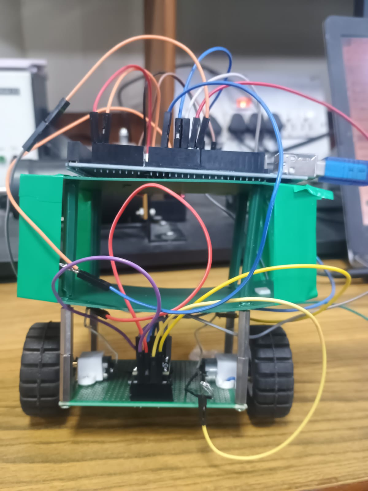
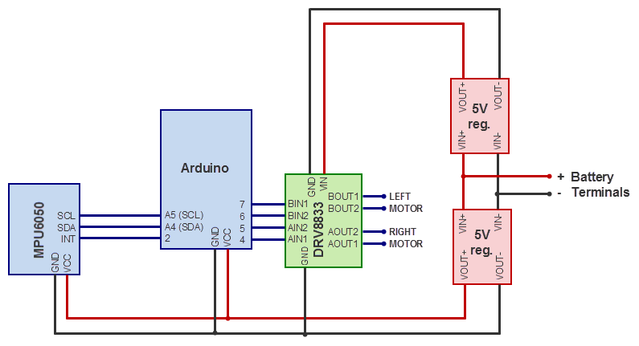
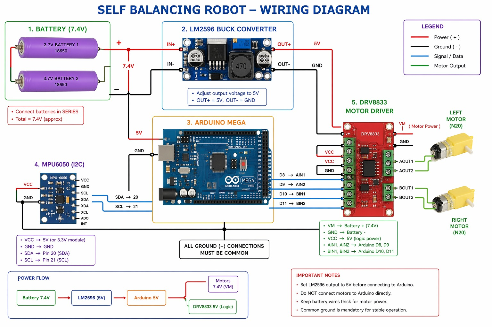
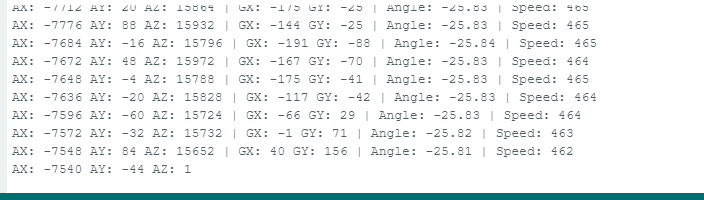
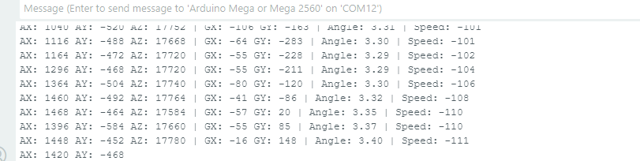
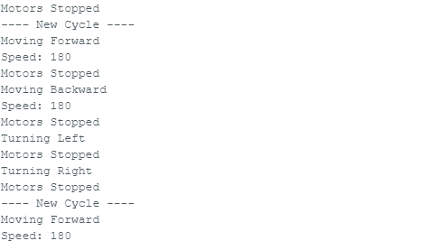

# 🤖 Self-Balancing Two-Wheeled Robot (Inverted Pendulum System)
## 📸 Robot Setup

## 🔌 Circuit Diagram

## 🔗 Connection Diagram

---

##  Overview
This project presents the **design and implementation of a self-balancing two-wheeled robot**, modeled as an **inverted pendulum system**. The robot maintains its upright position using real-time sensor feedback and control algorithms.

The system integrates:
- IMU sensing (MPU6050)
- Sensor fusion using Kalman Filter
- Control using PID and LQR
- Real-time embedded implementation (Arduino Mega)

---

##  Objectives
- Develop a dynamically stable two-wheeled robot  
- Estimate tilt angle using accelerometer and gyroscope  
- Implement Kalman filter for noise reduction  
- Design and tune PID controller  
- Implement LQR-based optimal control  
- Compare classical vs optimal control performance  

---

##  Hardware Components

| Component | Description |
|----------|------------|
| Arduino Mega 2560 | Main controller |
| MPU6050 | IMU (Accelerometer + Gyroscope) |
| DRV8833 | Dual H-bridge motor driver |
| N20 DC Motors | Actuation system |
| Battery | Power supply |
| Chassis & Wheels | Mechanical structure |

---

##  Hardware Connections

### MPU6050 to Arduino Mega

| MPU6050 | Arduino |
|--------|--------|
| VCC    | 5V     |
| GND    | GND    |
| SDA    | Pin 20 |
| SCL    | Pin 21 |

---

### Motor Driver (DRV8833)

| DRV8833 | Arduino |
|--------|--------|
| AIN1   | 4      |
| AIN2   | 5      |
| BIN1   | 7      |
| BIN2   | 6      |

---

##  System Working Principle

The robot follows a closed-loop control system:

1. Read sensor data (MPU6050)  
2. Estimate tilt angle (Kalman Filter)  
3. Compute error from vertical position  
4. Apply control algorithm (PID / LQR)  
5. Generate PWM signals  
6. Drive motors to correct tilt  

---

## 📐 Mathematical Model

### Accelerometer Angle
θ = tan⁻¹(ay / az)

### Gyroscope Angular Velocity
ω = (gx − bias) / 131

---

##  Control Algorithms

### PID Controller
u = Kp·e + Ki∫e dt + Kd(de/dt)

### LQR Controller
u = −Kx

---

##  Implementation Steps

1. Motor Testing  
2. IMU Data Acquisition  
3. Kalman Filter Implementation  
4. Sensor + Motor Integration  
5. PID Controller Implementation  
6. LQR Controller Implementation  

---

##  Results & Observations

| Stage | Observation |
|------|------------|
| Raw IMU | Noisy and unstable |
| Kalman Filter | Smooth and accurate |
| PID Control | Stable balancing achieved |
| LQR Control | Smoother and optimal response |

## 📊 Results

### Raw Angle vs Filtered Angle

### PID Output

### LQR Output

### Motor Test Output

---

##  Key Insights

- Kalman filter significantly reduces noise  
- PID is practical and easy to implement  
- LQR provides better theoretical performance  
- System stability depends on tuning and hardware design  

---

##  Challenges Faced

- Sensor noise and drift  
- Motor mismatch  
- Controller tuning difficulty  
- Real-time response constraints  

---

##  Future Improvements

- Add wheel encoders  
- Implement full state-space model  
- Use adaptive / AI-based control  
- Wireless monitoring system  

---

##  Demonstration

(Add your video link here)

---

##  Authors

- Akhilesh Kumar Patel  
- Anurag Paul  
- Dilkash Raja Khan  

---

##  Institution

Indian Institute of Technology Delhi  
Department of Electrical Engineering  

---

## 📜 License

MIT License
